# **Curry Tales**

Curry Tales is an e-commerce website offering a curated selection of South Indian grocery items and snacks. We provide authentic products such as masala powders, rice varieties, and traditional snacks, bringing the flavors of South India to your doorstep. Users can easily browse, add items to their cart, and complete their purchases via a simple checkout process. With a user-friendly interface, profiles for order tracking, and a newsletter powered by Mailchimp, Curry Tales offers a seamless shopping experience for food lovers. Join us to explore the tastes of South India.

[Access live website here](https://curry-tales-24f92d02dabe.herokuapp.com/)


### Responsive Testing
I attempted to use the Am I Responsive? tool to display how the site appears across multiple devices. However, due to deployment and Heroku-specific constraints, the site could not be loaded through the tool.

As an alternative, I manually captured screenshots of the site in different viewports to demonstrate its responsiveness:

* Desktop View


* Tablet View


* Mobile View

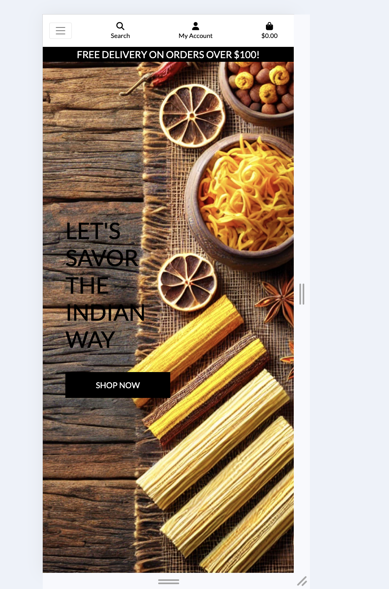

<br>


This fictional website has been created as part of Portfolio Project #5 (Full-Stack Toolkit) for the Diploma in Full Stack Software Development at the [Code Institute](https://www.codeinstitute.net). While the website offers an authentic shopping experience, no real transactions are processed, and no payment information is stored. It is intended for educational purposes to demonstrate full-stack development skills.

# Table of Content

* [**Project**](<#project>)
    * [Objective](<#objective>)
    * [Site Users Goal](<#site-users-goal>)
    * [Site Owners Goal](<#site-owners-goal>)
    * [Business Model](<#business-model>)
    * [Marketing Techniques](<#marketing-techniques>)
    * [Project Management](<#project-management>)
    * [Database Schema](<#database-schema>)

* [**User Experience (UX)**](<#user-experience-ux>)
    * [Wireframes](<#wireframes>)
    * [User Stories](<#user-stories>)
    * [Site Structure](<#site-structure>)
    * [Design Choices](<#design-choices>)

* [**Features**](<#features>)

* [**Existing Features**](<#existing-features>)
    * [Navigational Features](<#navigation>)
    * [General Features](<#footer>)
    * [E-commerce Features](<#home>)
    * [Confirmation Features](<#about>)
    * [Admin Features](<#faq>)


* [**Future Features**](<#future-features>)

* [**Technologies Used**](<#technologies-used>)
    * [Languages](<#languages>)
    * [Frameworks & Software](<#frameworks--software>)
    * [Libraries](<#libraries>)

* [**Testing**](<#testing>)
    * [Testing User Stories](<#testing-user-stories>)
    * [Code Validation](<#code-validation>)
    * [Additional Testing](<#additional-testing>)
    * [Bugs](<#bugs>)
* [Deployment](<#deployment>)
* [Credits](<#credits>)
* [Acknowledgements](<#acknowledgements>)

<hr>
<hr>

# Project

Everything on this webpage is for educational purposes only, documentation on where pictures and information are coming from is in the credit section

## Objective
The idea for Curry Tales came from my love for South Indian cuisine, inspired by my family's rich food traditions. While I may not be the chef, I’ve always been surrounded by the vibrant flavors of South Indian dishes. This project is a tribute to my family, especially my mother, and aims to bring authentic South Indian grocery items and snacks to a wider audience. Created as part of my final project for the Code Institute Full Stack Software Developer course, this website showcases a piece of my heritage and passion for food.


### Site Users Goal
Site users can browse the website to explore a variety of South Indian grocery items and snacks, gain inspiration for their next meal. The site is designed for easy navigation, with a simple checkout process. Users can contact the admin for any questions or suggestions and subscribe to the Curry Tales newsletter to stay updated on new products, promotions, and sales. The About page offers insights into the site’s mission. Users can create profiles to save information for future purchases and track past orders, though profile creation is optional to make a purchase.


### Site Owners Goal
Besides providing a fully functional and welcoming E-commerce website, the admin can modify all important data either via frontend implementation, like adding, editing or deleting products, or through the admin panel, like changing the about page or editing categories. Any contact request will be send to the admin panel, providing important information like name and email. The admin can keep track of orders and collects payment info via [stripe](https://stripe.com) and collects the email addresses on [Mailchimp](https://www.mailchimp.com/) with the option to send out customized newsletters. More information about all [features](<#existing-features>) and the [future features](<#future-features>) are below.


[Back to top](<#table-of-content>)

## Business Model
Curry Tales is a Business to Consumer (B2C) e-commerce platform that offers South Indian groceries and snacks to a wide audience. The store features a variety of products, ranging from affordable everyday grocery items to premium specialty snacks for those seeking authentic South Indian flavors. We also offer curated collections for food lovers, including traditional spices, masala mixes, and unique snacks.

While providing a diverse range of South Indian food products, Curry Tales encourages users to interact with the site’s owners to ensure that the store continues to meet their needs. The philosophy behind Curry Tales is to be as customer-focused as possible, emphasizing excellent customer support. We prioritize building a smaller, loyal customer base rather than striving to become the largest online marketplace for groceries.
<!-- Check .. do we have the following section-->
More information about how this would be possible are in the [future features](<#future-features>) section.

[Back to top](<#table-of-content>)
<!-- Check .. do we have the challenges that he talks about-->

## Marketing Techniques
 After completing the challenges from the LMS, I’ve decided to focus on strong SEO and email marketing through newsletters as key objectives. If Curry Tales were a live e-commerce platform, I would start by promoting it on social media, running targeted ads on Facebook and Instagram, and collaborating with food influencers on platforms like TikTok and Instagram. For more details, see the final section of the marketing challenge below.

### Challenges
Below are the results of completing the three challanges from the LMS SEO and Web Marketing lessons:

<details><summary><b>Challenges</b></summary>
<br>

#### SEO Challenge:

<details><summary><b>SEO Challenge</b></summary>
<br>
<hr>

1. Brainstorm your general topics
<br>

- South Indian Cuisine
- Western Twist Dishes
- Ready-to-eat Meals
- Indian Spices
- Popular Curry Dishes
- Street Food Inspired Meals

<hr>

2. Brain dump possible keywords for each of the general topics
<br>

South Indian Cuisine:

- Masala Dosa
- Sambar Rice
- Idli and Vada
- Tamil Nadu Recipes


Western Twist Dishes:

- Fusion Curry Recipes
- Masala Dosa Wrap
- Curry Burritos
- Indian Street Food Fusion

Ready-to-eat Meals:

- Instant Indian Food
- Curry Meal Kits
- Easy-to-make Indian Meals
- Frozen Indian Dishes

Indian Spices:

- Garam Masala
- Curry Powder
- Turmeric Benefits
- South Indian Spice Mix

Popular Curry Dishes:

- Chicken Curry
- Paneer Butter Masala
- Vegetable Korma
- Lamb Rogan Josh

Street Food Inspired Meals:

- Pav Bhaji
- Pani Puri
- Chaat Recipes
- Indian Burgers

<hr>

4. Ensure you have a selection of short and long-tail keywords
<br>

Short-tail:

- Curry meals
- Indian food online
- Ready-to-eat meals
- South Indian curry
- Fusion food delivery
- Indian spices

Long-tail:

- Best ready-to-eat South Indian meals
- Masala dosa wraps with a Western twist
- Buy South Indian curry online
- Fusion Indian food for busy days
- Freshly made street food inspired meals
- Ready-to-cook Indian curry kits for home chefs
- Spicy curry meals delivered to your door 

<hr>

5. Final Keyword Selection
<br>

- Buy Indian fusion curry meals online
- Ready-to-eat South Indian meals
- Curry meal kits with a Western twist
- Authentic Indian food delivery
- Indian spice kits for home cooking
- Traditional South Indian curry recipes
- Fresh fusion street food
- Dosa wraps and fusion curry bowls

[Back to top](<#table-of-content>)

</details><br/>

<hr>


#### Content Challenge

<details><summary><b>Content Challenge</b></summary>
<br>

<hr>

1. What do your users need?
<br>

- Easy navigation through various types of ready-to-eat meals
- Detailed information about each dish, including ingredients and nutritional info
- Simple online ordering and checkout process
- Ability to customize orders (e.g., spice levels)
- Suggestions for meal pairings or full meal sets
<hr>

2. What information and features can you provide to meet those needs?
<br>

- Implement an advanced search function with filters for types of meals, ingredients, spice levels, and delivery options
- Create a homepage with featured products, new releases, and seasonal specials
- Provide detailed descriptions of each meal, including ingredient lists, nutritional information, and preparation tips
- Streamline the ordering process with easy customization options for spice levels and meal sizes
- Provide an "Order Now" feature with quick checkout options

<hr>

3. How can you make the information easy to understand?
<br>

- Use clear, concise language for meal descriptions and ingredients
- Organize meals by categories (e.g., "Spicy Curries," "Wraps," "Ready-to-cook Kits")
- Include images of meals to help customers visualize what they’re ordering
- Implement a simple, step-by-step ordering process with clear calls to action (e.g., "Order Now," "Customize Your Spice Level")
- Offer a live chat option to assist with any queries

<hr>

4. How can you demonstrate expertise, authoritativeness and trustworthiness in your content?
<br>

- Highlight your experience in preparing authentic South Indian food with a modern twist
- Provide in-depth meal descriptions and ingredient sourcing details
- Display customer ratings and reviews prominently (optional)
- Include an "About Us" page detailing your brand story, values, and expertise in creating fusion meals

<hr>

5. Would there be other pages within your own site you could link to from your chosen page? (optional)
<br>

- Link to related meals, including recommendations for side dishes or drinks
- Provide a "You might also like" section with suggested meals
- Link to an "About our Spices" page that explains where the spices come from and how they are sourced
- Create landing pages for seasonal specials or meal bundles

<hr>

6. Are there opportunities to link back to external websites that already rank highly on Google?
<br>

- Link to reputable food blogs or publications that cover fusion recipes or South Indian cuisine
- Partner with well-known Indian food YouTubers or influencers for cross-promotion
- Link to reviews or features in magazines or websites that cover global cuisine or fusion trends

<hr>

7. How can you help users discover other relevant parts of your web application?
<br>

- Create a "Featured Meals" carousel on the homepage with seasonal or popular dishes
- Use tags to connect meals with similar ingredients or flavor profiles
- Implement a "Meal of the Week" or "Chef’s Pick" feature
- Create a "Meal Combos" section with curated meal sets (e.g., combo meals for families or spice lovers)

[Back to top](<#table-of-content>)

</details><br/>

<hr>

#### Marketing Types Challenge

<details><summary><b>Marketing Types Challenge</b></summary>
<br>

<hr>

1. Who are your users?
<br>

- People who enjoy South Indian food with a modern twist
- Busy professionals looking for quick meal solutions
- Foodies who love fusion cuisine
- Indian expats craving authentic food from home

<hr>

2. Which online platforms would you find lots of your users?
<br>

- Instagram (especially the food and recipe community)
- Facebook (food-related groups and pages)
- TikTok (recipe videos and food trends)
- Pinterest (for meal inspiration and recipes)
- Reddit (subreddits related to food, cooking, and fusion cuisine)

<hr>

3. Would your users use social media? If yes, which platforms do you think you would find them on?
<br>

- Instagram (foodstagram community, food bloggers)
- TikTok (quick recipe videos, fusion food)
- Pinterest (meal ideas and recipes)
- YouTube (recipe and meal prep tutorials)
- Facebook (local food groups and pages)

<hr>

4. What do your users need? Could you meet that need with useful content? If yes, how could you best deliver that content to them?
<br>

- Meal inspiration and recipe ideas
- Information about new products and seasonal meals
- Behind-the-scenes content showing food preparation
- Delivery and order tips

Content ideas: 
<br>

- Blog posts about fusion recipes and their origins
- Social media posts showcasing meal prep or behind-the-scenes cooking
- How-to videos showing how to prepare and customize dishes

Delivery methods:
<br>

- Social media posts (especially Instagram and TikTok for visuals)
- Email newsletters with updates on new products and seasonal dishes
- YouTube videos for cooking tutorials or food reviews
- Blog posts on the website (if a blog is implemented)

<hr>

5. Would your business run sales or offer discounts? How do you think your users would most like to hear about these offers?
<br>

- Email newsletters
- Social media posts (Instagram Stories, TikTok videos)
- Limited-time offers (e.g., "Spicy Curry Week" or "Fusion Feast Deals")

<hr>

6. What are the goals of your business? Which marketing strategies would offer the best ways to meet those goals?
<br>

- Increase sales and grow customer base
- Establish the brand as a go-to source for fusion South Indian meals
- Build a loyal customer community
- Marketing strategies:
- Influencer marketing with food bloggers or YouTubers
- Organic social media marketing (Instagram, TikTok, Pinterest)
- Content marketing (blog posts, recipe videos, meal tutorials)
- Email marketing for personalized meal suggestions and promotions
- SEO to improve visibility for relevant search terms

<hr>

7. Would your business have a budget to spend on advertising? Or would it need to work with free or low cost options to market itself?
<br>

Paid (small budget):
<br>

- Targeted social media ads on Facebook and Instagram
- Sponsored posts with mid-tier food influencers

Free:
<br>

- Organic social media growth
- Content marketing through our blog and social channels
- Email marketing to our subscriber list

Long-term:
<br>

- Collaborations with food bloggers for recipe features
- Hosting online cooking classes or webinars

</details><br/>

</details><br/>

## About Facebook:

I own a private Facebook account (inactive), that I am refusing to reactivate because I do not want to agree to the current Meta terms and conditions. In the Code Institute LMS, we were provided with a Facebook mockup for balsamiq and got the information that if we do not wish to create a real facebook account, the mock ups are enough since ficticious business pages get closed very quickly anyway. Since I do not wish for Meta to have access to my personal data, nor do I see why a facebook page has anything to do with my coding capabilities, I decided to go with the mockup.


* From the acceptance criteria:

</details><br/>

While going over the acceptance criteria one last time, I saw that it is a must criteria to create the Facebook page. Since using my personal inactive Facebook account is out of the question, I decided to create a new account - which is at this time impossible for this project, since they will need to verify the account, which will take up to a day. Needless to say I did not upload my personal picture, nor did I add my actual information - so the chances that the account will not be autheticated are there as well. Therfore for this project, there will only be a mock up for the Facebook Business page.

<details><summary><b>Facebook Mockup</b></summary>

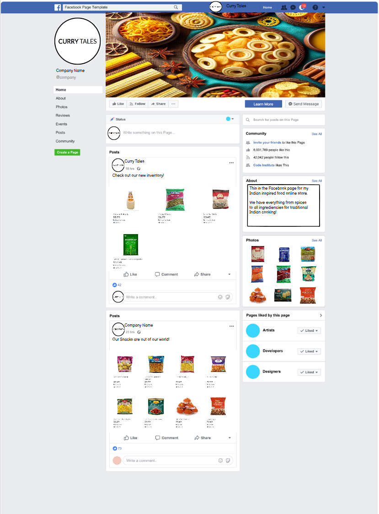 

</details><br/>


[Back to top](<#table-of-content>)

<hr>

## Project Management

### Github Board
For organizing and planning my project, I have used the , which has helped me a lot with planning out and fulfilling the acceptance criteria. I have thoroughly kept the user stories up to date with the coding progress. Additionally, I have used multiple .txt files to keep up with ideas, documentation, my mentor meetings and bugs to implement in this documentation. 

<br>

</details><br/>

## Database Schema


The database schema was created with [BugBytes](https://www.youtube.com/watch?v=qzrE7cfc_3Q&t=478s) YouTube video and the corresponding tool [dreampuf](https://dreampuf.github.io/GraphvizOnline/). Due to certain reasons I could not completely follow my time plan, therefore I was unable to create a database schema myself, which was planned to be done with [Lucid](https://lucid.app/documents#/home?folder_id=recent). 

* **Product** - Handles all products
* **Categories** - Handles all categories - connected to the item category
* **Order** - Handles all orders
* **OrderLineItem** - Handler between the products and a users order for checkout
* **Profile** - Handles the user profile information (full name, delivery information and order history for the specific user). There is a one-to-one relation to the user model to connect it to the standard user model.
* **About** - Handles the about information provided through the admin panel
* **Contact** - Handles all contact requests and sends them to the admin panel
* **All-Auth** - Various models included due to all-auth that handle users, email addresses and more


</details><br/>


# User Experience (UX)

## Wireframes
The wireframes for the site were created in the software [Balsamiq](https://balsamiq.com). The wireframes have been created for desktop, tablet and mobile devices. The text content wasn't finalized during the wireframe process. Also I have decided to only focus on the user side since the admin frontend capabilities are less important for styling. For the Facebook mock up i have used the provided template from [Code Institute](https://codeinstitute.net/)

<details><summary><b>Open Wireframes</b></summary>

<details><summary><b>Wireframes: Home</b></summary>

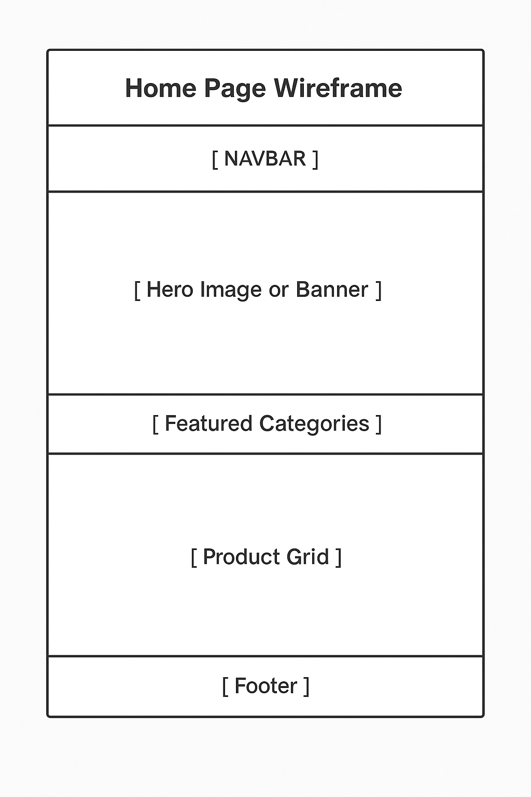<!-- Check some image here-->

[Back to top](<#table-of-content>)

</details><br/>


## User Stories

<details><summary><b>Site User</b></summary>

### Site User


|  | | |
|:-------:|:--------|:--------|
| As a Site User | I can enter the page on the 'home' page so that I can see featured South Indian dishes and snacks immediately | &check; |
| As a Site User | I can see all products and sort them to my preferences so that I can browse all items to see what is interesting for me | &cross; |
| As a Site User | I can view detailed information about an item so that I can make an informed purchase decision | &check; |
| As a Site User | I can browse items by categories so that I can find items I'm interested in | &check; |
| As a Site User | I can sort by categories so that I can search for items which category interests me | &check; |
| As a Site User | I can use a search function so that I can find specific items quickly | &check; |
| As a Site User | I can see pictures and infos about items so that I can get background info on what goes into them | &check; |
| As a Site User | I can create an account so that I can make purchases and access personalized features | &check; |
| As a Site User | I can log in to my account so that I can access my profile | &check; |
| As a Site User | I can view my order history so that I can track the status of my current and past orders | &check; |
| As a Site User | I can add items to my shopping cart so that I can purchase multiple items at once | &check; |
| As a Site User | I can edit the contents in the shopping cart so that I do not buy items or quantities I do not want | &check; |
| As a Site User | I can proceed through an easy checkout process so that I can complete my purchase without problems | &check; |
| As a Site User | I can safely process payments so that my financial information is secure | &check; |
| As a Site User | I can enter and save my delivery information in my profile so that I can use it for future purchases | &check; |
| As a Site User | I will get an email confirmation after a purchase so that I know the order has been placed and I get additional info about it | &check; |
| As a Site User | I can reset my password so that I am not excluded from the page if I forgot my old password | &check; |
| As a Site User | I can access a contact form so that I can submit questions or feedback to the website | &check; |
| As a Site User | I can view an 'About Us' page so that I can learn more about the website and its expertise | &check; |
| As a Site User | I can subscribe to a newsletter so that I can receive updates about new additions and promotions | &check; |
| As a Site User | I cannot access an invalid url so that a custom error page will give me the information on what went wrong | &check; |
| As a Site User | I can receive a discount and/or free shipping when my purchase exceeds a certain amount so that I am encouraged to place larger orders | &check; |


</details><br/>

<details><summary><b>Site Admin</b></summary>


### Site Admin

|  | | |
|:-------:|:--------|:--------|
| As a Site Admin | I can add new items to the store and remove old ones so that I can keep the catalog up-to-date | &check; |
| As a Site Admin | I can create and manage food categories so that I can keep the store organized | &check; |
| As a Site Admin | I can manage user accounts so that there are no unwanted customers | &check; |
| As a Site Admin | I can manage the content of the "About Us" page and other static pages so that I can keep the information current | &check; |


</details><br/>

<details><summary><b>Developer</b></summary>

### Deleloper

|  | | |
|:-------:|:--------|:--------|
| As a Developer | I can implement SEO best practices so that the website ranks higher in search engine results | &check; |
| As a Developer | I can implement secure coding practices so that the application is protected against common vulnerabilities | &check; |

</details><br/>

<details><summary><b>Epics</b></summary>

### Epics

The following describes the epics of which each user story has one. To see which user story has which epic, please visit the [Github board]

* Epic 1: User Authentication and Profile Management
* Epic 2: Product Browsing and Search
* Epic 3: Shopping Cart and Checkout
* Epic 4: Order Management
* Epic 5: Content Management
* Epic 6: Marketing and Communication
* Epic 7: Admin Functionality
* Epic 8: Security and Authentication

</details><br/>

[Back to top](<#table-of-content>)

## Site Structure

Curry Tales has been designed to allow any user to access all features without needing a profile (user profile and order history are the exceptions). Users can browse and place orders for various products, such as curries, snacks, and ready-to-eat meals. The website is fully responsive, ensuring a seamless experience across all screen sizes, from mobile phones to desktop computers.

Upon entering the site, users are greeted with a welcoming header containing all the navigation elements, such as links to product categories, a search bar, and a shopping cart. The body of the homepage features an introductory message and a carousel showcasing featured products, with each image redirecting users to its corresponding product page. Users can also easily navigate to the product detail pages for more in-depth information about each dish or snack, including ingredients, preparation, and nutritional info.

The "About Us" page offers background on the Curry Tales brand, while the "Contact Us"  page provides essential customer service information.

For the admin side, there are advanced front-end admin capabilities, such as adding, editing, or deleting products (dishes, snacks, or ingredients), managing categories, updating product information, and handling customer queries via the admin panel. Admins (superusers) can directly access and manage these features via a special admin button, ensuring smooth management of the website's content and functionality.

## Design Choices

### Color Scheme
The color scheme for Curry Tales was carefully chosen to reflect the rich, vibrant colors found in South Indian cuisine. The primary color palette is inspired by warm, earthy tones like turmeric yellows, masala reds, and curry greens, which evoke the spices and flavors of traditional South Indian cooking. Accent colors are drawn from the natural hues of rice, coconut milk, and rustic clay, creating an inviting, authentic feel. This color palette complements the branding and theme of the website, enhancing the user experience while also emphasizing the warmth and homeliness of South Indian food.

[Coolors](https://coolors.co/) was used to create the color palette:

<details><summary><b>Color Palette</b></summary>
<br>
<br>

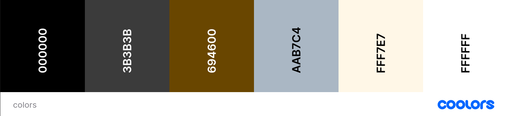
[Back to top](<#table-of-content>)

</details><br/>

### Typography
The fonts used for the site are 'Lato'. 

'Lato' is used on the whole webpage. Choosing this font family was because I thought it would fit the theme.

<br>
<br>

</details><br/> 

[Back to top](<#table-of-content>)

# Features
This section is devided in [Existing Features](<#existing-features>) and [Future Features](<#future-features>) since there are more features needed for the production ready page.

## Existing Features

This section will be devided into multiple sub sections:

## Navigational Features

<details><summary><b>Open</b></summary>

### Navigation
The styling of the navigation bar was heavily influenced by the [Boutique ADO](https://boutique-ado-mj-102bd7708d45.herokuapp.com/) <!-- Check if this heroku link given above is ok--> walkthough website, while I tried to keep it as clean as possible. The only differences are between Admins and any other users - in addition to the usual navigation, the admin also has a "Product Management" option in the profile dropdown.

The following is devided into mobile and desktop views, showing how each individual dropdown menu looks according to the screen size:

<details><summary><b>Navigation Large</b></summary>

* Main Navigation:

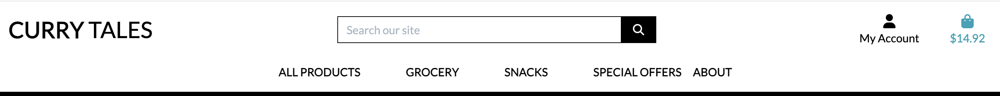<!-- Check some image here-->

* Dropdown About Us

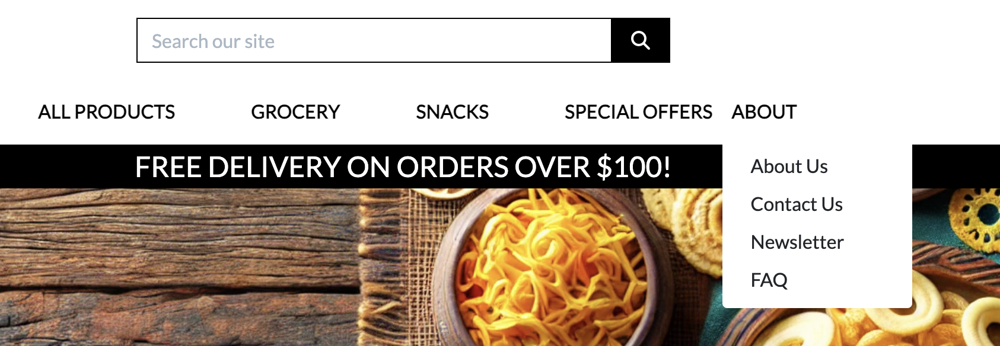<!-- Check some image here-->


<details><summary><b>Navigation Small</b></summary>

* Small Navigation:

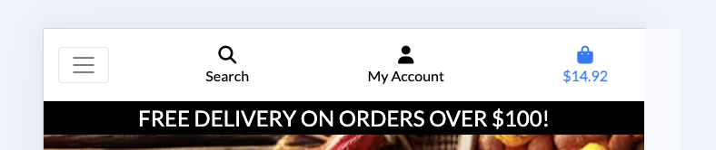<!-- Check some image here-->

* Small Navigation opened

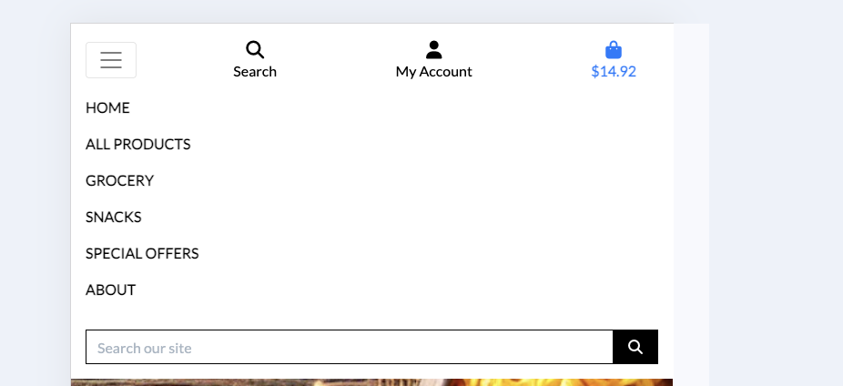<!-- Check some image here-->

* Dropdown My_Account

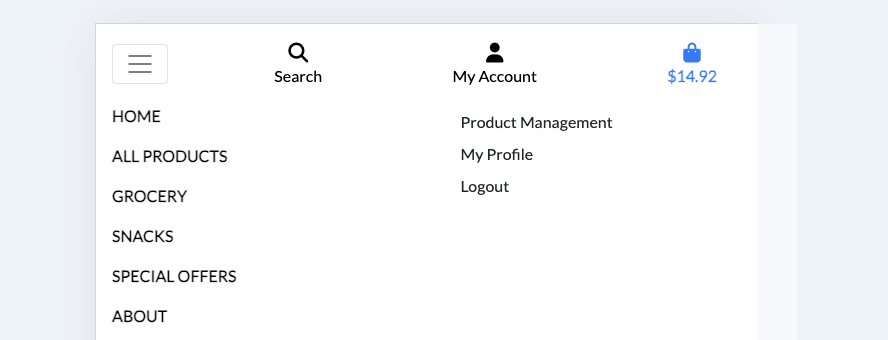<!-- Check some image here-->


</details><br/>


## General Features

<details><summary><b>Open</b></summary>

### Home
The home page is simplistic, easy to navigate and fully responsive: 

<details><summary><b>Home</b></summary>

* Home Dekstop

<!-- Check some image here-->


* Delivery banner that informs the user about minimum order amount before getting free shipping

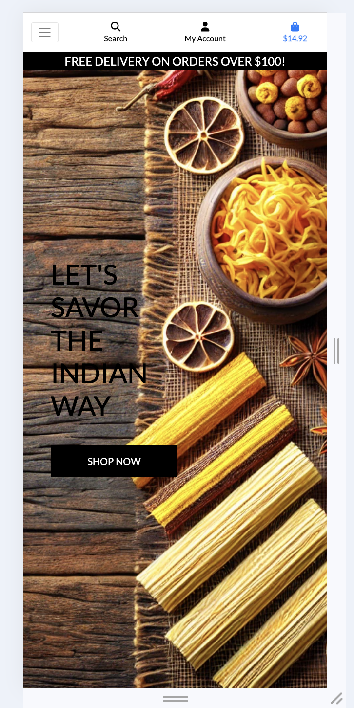<!-- Check some image here-->


[Back to top](<#table-of-content>)

</details><br/>


### About
The About page features a welcoming picture, as well as information about the store and its ideology. 

<details><summary><b>About</b></summary>

* About Dekstop

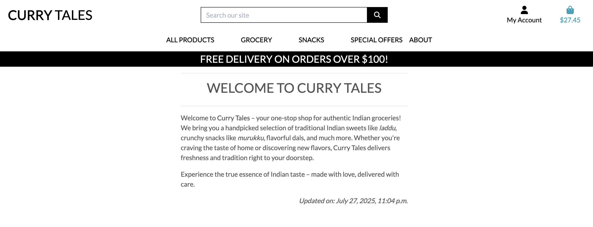<!-- Check some image here-->

* About Mobile

</details><br/>

### Contact Page
The Contact Us page features a a form which includes *Name*, *email*, *subject* and *message* that gets send directly towards the admin panel.


[Back to top](<#table-of-content>)

</details><br/>


### Newsletter
The Newsletter used in this project was designed and set up with [Mailchimp](https://www.mailchimp.com/). At the moment, a user will only get a newsletter subscription confirmation email, but Mailchimp allows to schedule outgoing emails and a variety of other possible marketing option.

<details><summary><b>Newsletter</b></summary>

* Newsletter Dekstop

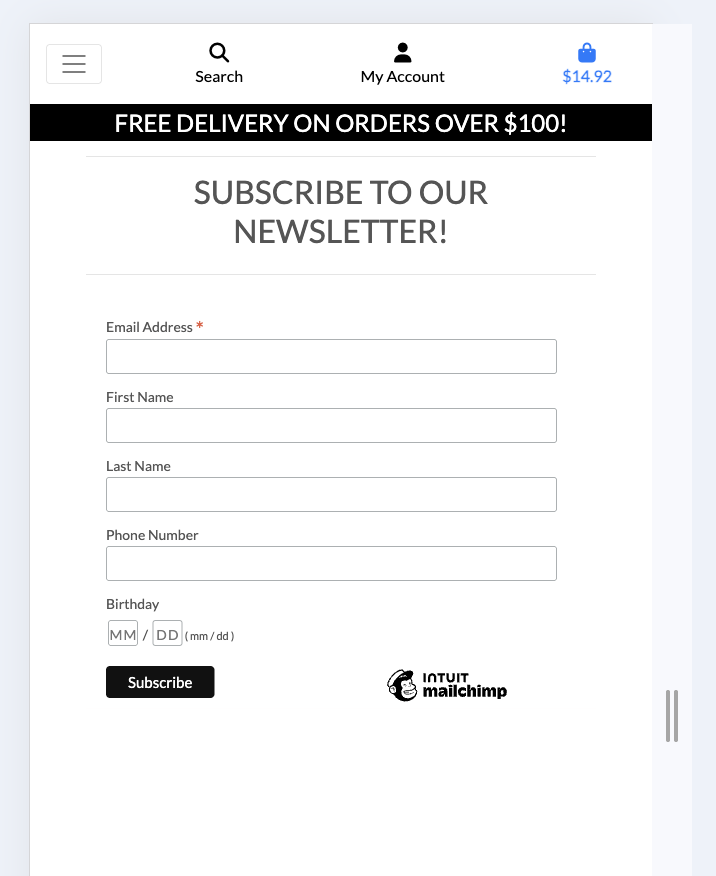<!-- Check some image here-->

* Newsletter Mobile

<!-- Check some image here-->

[Back to top](<#table-of-content>)

</details><br/>

### Products Page
The Products page shows all available South Indian food items and snacks in the store with a picture, name of the item, the ingredients or description, the category it belongs to, and the price of the item. The user has to click on the picture of the item to get redirected to the Product Detail View.

The Products Page is divided into 4 columns, which reduce to just one column, depending on the screen size, ensuring a responsive design across all devices.


</details><br/>

### Product Detail Page
In the Product detail Page, the user gets all the information of each individual item. Not every item has all fields filled out, but mostly, all of the fields are filled out. 

The fields which are available:

* Picture
* Name
* Ingredients
* SKU
* Price
* Description1: A brief description of the dish or snack
* Description2: Additional information
* Extra Info


## E-commerce Features

<details><summary><b>Open</b></summary>

### Shopping Bag
The shopping bag does exactly what a shopping bag should do: You can add and remove items, as well as adjusting the quantity of each item in the bag. The bag displays the nessesary information about the product or products the user would like to purchase like name, picture and price. Depending on mobile or desktop view, the layout is a bit different, to make the process to the checkout page as easy as possible. The shopping bag also informs the user about delivery costs or if the minimum for free delivery has been reached.


</details><br/>

### Checkout
In the checkout view, the user has to provide their name, email, shipping details and credit card details. If the user already has a profile, they can save the information to their profile or if they have already filled out all infos, either through an earlier purchase or by filling out the profile form manually, the checkout form will be pre populated (excluding the payment information).


### Checkout Success
The checkout success page provides the user with their order details, including an order summary, order number and the info that a confirmation mail will be send to the by the user provided email address.


### Stripe
Stripe is working as intended. All payments are going through and no errors are reported.


### Mailchimp
I used Mailchimp to set up my newsletter, where all the email addresses will be collected. Due to privacy reasons, I cannot show all collected email addresses.

</details><br/>

## Profile Features

<details><summary><b>Open</b></summary>

### Register
The sign up page is a modified all auth template that fullfills the basic "sign up" features like email and password input and validation and a user name. Also it gives the user twice the option to change to the "sign in" page.


### Log In
The Log in page is a modified all auth template that fullfills the basic "sign in" features. The user has to provide an email or username as well as their password. Also it gives the user the option to change to the "sign up" page or to reset their password.

### Logout
The Logout page is a modified all auth template that fullfills the basic "logout" features - it logs the user out.


### Reset Password
The Reset Password page is a modified all auth template that fullfills the basic "Reset Password" features. A user must provide their email and will get an email with a link to reset their password

</details><br/>


### Profile
The profile page consists of two parts: The users profile info, including name, email and shipping address and as the second part the order history. If a user clicks on one of the order history items, they will be redirected to the corresponding checkout success page.


### Pop Up Messages
There are a variety of different Pop Up messages - depending on what the user (or admin) wants to do, most functionalities are connected to a notification. In general, there are different types of messages:

* Success messages: any action the user does which requires a positive feedback, like adding items to the cart, logging in or an admin updates the database successfully
* Info messages: mostly admin related, which informs about editing the database, or when a user clicks a past oder summary
* Warning message: for endusers, this only appears when the stripe public key is missing - the admin will be presented with this message if they want to delete a product or author
* Error message: this message either informs the user about an error that occured, or if a normal user tries to use an admin path
* Newsletter error message: if the user enters an invalid email format, an error message will appear
* Newsletter success message: if the user subscribes to the newsletter, a success message will appear

Site note: the admin success messages look different than for the users: users only get success confirmation for interacting with the store, so they will be shown a summary of their shopping bag, while the admin does not get the preview (reason: the admin gets success messages more frequently and usually does not shop in their own store).


</details><br/>

### Confirmation Emails
When a user registers, they have to confirm their email address with a link they will be provided with in an email. Also if a user places an order, they will get an email confirmation with the details of the order.


</details><br/>

## Admin Features

### Product Management
When a superuser is logged in, they will get another item in the account dropdown labled "Product Management". On this page, they have the option to navigate to the admin panel without having to modify the url and to add a product, category, author or a FAQ item.

<details><summary><b>Product Management</b></summary>


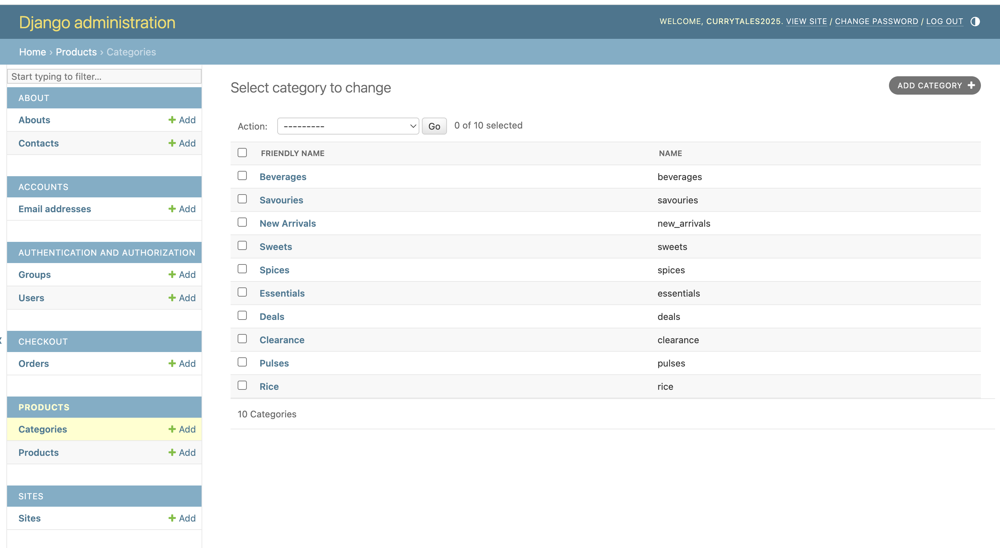<!-- Check some image here--> 

</details><br/>

### Add Product
This is the front end page where an admin can add a product.

<details><summary><b>Add Product</b></summary>

* Add Product Full Form

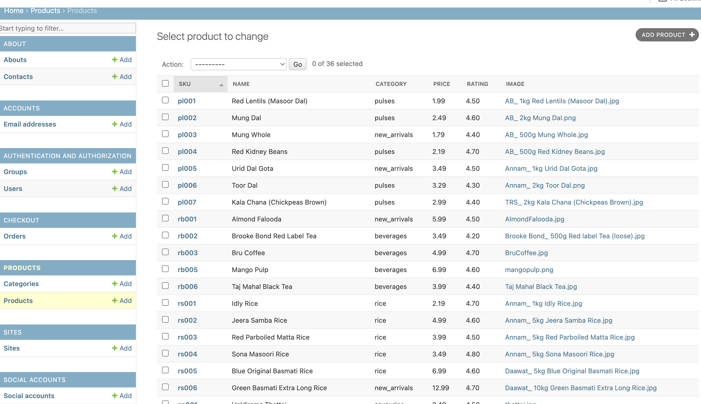<!-- Check some image here--> 

[Back to top](<#table-of-content>)

</details><br/>

### Edit Product
This is the front end page where an admin can edit a product. 


### Delete Product
This is the front end page where an admin can delete a product.


</details><br/>


### Add Category
This is the front end page where an admin can add a category. This form is shown in the mobile view as an example on how the other "Add ..." forms look like on a mobile view

<details><summary><b>Add Category</b></summary>

* Desktop Add Category

 <!-- Check some image here--> 

[Back to top](<#table-of-content>)

</details><br/>


### Admin Panel
On the admin panel, an admin can access all profiles, email addresses, order, products and every other model. Everything has full CRUD functionality, so all features that do not have a corresponding front end page can be modified here.

</details><br/>

## Future Features

### Marketing

* For a live website, future features include all the marketing ideas I came up with in in the marketing challange
* An extension of the newsletter: Besides only getting a confirmation email, I would implement another email, timed possibly 24 hours after signing up, giving some sort of discount to make the user come back to the page. Also a bi-weekly or monthly newsletter should be implemented

### Features

* Adding the remaining user stories
* Admin capability: Responding to contact requests via the website
* Bugfixes (see "Bugs" section)
* Adding a "Back to log in" button to the confirmation page which a user gets after resetting their password
* Implementing some kind of discounts or loyalty rewards (user story)
* Add a contact us modification so that the user gets the notification via email with their whole request
* Implement a function that keeps track of the inventory so that an admin can specify on how many products are available
* Extend the search function to also include About page
* If an admin deletes an author or category, corresponding relations between the deleted models and the products should be applied
* Adding an "Out of stock" label which disables the possibility to order an item, but it can still be displayed on the page

[Back to top](<#table-of-content>)

# Technologies Used

## Languages

* [Python](https://en.wikipedia.org/wiki/Python_(programming_language)) - Provides the functionality for the site.
* [HTML5](https://en.wikipedia.org/wiki/HTML) - Provides the content and structure for the website.
* [CSS3](https://en.wikipedia.org/wiki/CSS) - Provides the styling for the website.
* [JavaScript](https://en.wikipedia.org/wiki/JavaScript) - Provides interactive elements of the website

## Frameworks & Software <!-- Check this section--> 

* [Bootstrap](https://getbootstrap.com/) - A CSS framework that helps building solid, responsive, mobile-first sites
* [Django](https://www.djangoproject.com/) - A model-view-template framework used to create the Books and Giggles site
* [Balsamiq](https://balsamiq.com/) - Used to create the wireframe
* [Github](https://github.com/) - Used to host and edit the website
* [GitBash](https://en.wikipedia.org/wiki/Bash_(Unix_shell)) - Terminal in [Gitpod](https://www.gitpod.io) used to push changes to the GitHub repository
* [Heroku](https://en.wikipedia.org/wiki/Heroku) - A cloud platform that the application is deployed to
* [Lighthouse](https://developer.chrome.com/docs/lighthouse/overview/) - Used to test performance of site
* [Multi Mockup](https://techsini.com/multi-mockup/) - Used for responsiveness check
* [Graph Models](https://django-extensions.readthedocs.io/en/latest/graph_models.html) - Used to create a *.dot file of all models in the project
* [dreampuf](https://dreampuf.github.io/GraphvizOnline/) - Creates visually appealing database diagrams of *.dot files
* [Google Chrome DevTools](https://developer.chrome.com/docs/devtools/) - Used to debug and test responsiveness
* [AWS](https://aws.amazon.com/) - Amazon Web Services - used to host all static files and pictures from the project in a S3 Bucket
* [Stripe](https://stripe.com/) - A service provider to handle all payments on the website
* [HTML Validation](https://validator.w3.org/) - Used to validate HTML code
* [CSS Validation](https://jigsaw.w3.org/css-validator/) - Used to validate CSS code
* [PEP8CI Validation](https://pep8ci.herokuapp.com/) - Used to validate the Python Code
* [JSHint Validation](https://jshint.com/) - Used to validate JavaScript code

[Back to top](<#table-of-content>)

## Libraries
The libraries used in this project are located in the requirements.txt file and have been documented below

* [asgiref](https://pypi.org/project/asgiref/) - ASGI is a standard for Python asynchronous web apps and servers to communicate with each other, and positioned as an asynchronous successor to WSGI
* [boto3](https://pypi.org/project/boto3/) - Boto3 is the Amazon Web Services (AWS) Software Development Kit (SDK) for Python, which allows Python developers to write software that makes use of services like Amazon S3 and Amazon EC2. Boto3 is maintained and published by Amazon Web Services
* [botocore](https://pypi.org/project/botocore/) - A low-level interface to a growing number of Amazon Web Services. The botocore package is the foundation for the AWS CLI as well as boto3. Botocore is maintained and published by Amazon Web Services
* [click](https://pypi.org/project/django-click/) - django-click is a library to easily write Django management commands using the click command line library
* [Colorama](https://pypi.org/project/colorama/) - Makes ANSI escape character sequences (for producing colored terminal text and cursor positioning) work under MS Windows
* [crispy-bootstrap4](https://pypi.org/project/crispy-bootstrap4/) - Bootstrap5 template pack for django-crispy-forms
* [CSSbeautifier](https://pypi.org/project/cssbeautifier/) - Beautify, unpack or deobfuscate CSS
* [dj-database-url](https://pypi.org/project/dj-database-url/0.5.0/) - This simple Django utility allows you to utilize the 12factor inspired DATABASE_URL environment variable to configure your Django application
* [Django](https://pypi.org/project/Django/) - Django is a high-level Python web framework that encourages rapid development and clean, pragmatic design.
* [django-allauth](https://pypi.org/project/django-allauth/) - Integrated set of Django applications addressing authentication, registration, account management as well as 3rd party (social) account authentication.
* [django-countries](https://pypi.org/project/django-countries/) - A Django application that provides country choices for use with forms, flag icons static files, and a country field for models
* [django-crispy-forms](https://pypi.org/project/django-crispy-forms/) - Used to integrate Django DRY forms in the project
* [django-extensions](https://pypi.org/project/django-extensions/) - Django Extensions is a collection of custom extensions for the Django Framework
* [django-storages](https://pypi.org/project/django-storages/) - django-storages is a project to provide a variety of storage backends in a single library
* [django-summernote](https://pypi.org/project/django-summernote/) - Summernote is a simple WYSIWYG editor which allows you to embed Summernote into Django very handy. Support admin mixins and widgets
* [djLint](https://pypi.org/project/djlint/) - djLint is a community build project to and add consistency to html templates
* [EditorConfig](https://pypi.org/project/EditorConfig/) - EditorConfig makes it easy to maintain the correct coding style when switching between different text editors and between different projects. The EditorConfig project maintains a file format and plugins for various text editors which allow this file format to be read and used by those editors
* [gunicorn](https://pypi.org/project/gunicorn/) - Gunicorn ‘Green Unicorn’ is a Python WSGI HTTP Server for UNIX. It’s a pre-fork worker model ported from Ruby’s Unicorn project. The Gunicorn server is broadly compatible with various web frameworks, simply implemented, light on server resource usage, and fairly speedy
* [html-tag-names](https://pypi.org/project/html-tag-names/) - This is a list of HTML tag names. It includes ancient (for example, nextid and basefont) and modern (for example, shadow and template) names from the HTML living standard. The repo includes scripts to regenerate the data from the specs
* [html-void-elements](https://pypi.org/project/html-void-elements/) - Similar to "html-tag-names"
* [jmespath](https://pypi.org/project/jmespath/) - JMESPath (pronounced “james path”) allows you to declaratively specify how to extract elements from a JSON document
* [jsbeautifier](https://pypi.org/project/jsbeautifier/) - Beautify, unpack or deobfuscate JavaScript. Handles popular online obfuscators
* [oauthlib](https://pypi.org/project/oauthlib/) - OAuthLib is a framework which implements the logic of OAuth1 or OAuth2 without assuming a specific HTTP request object or web framework
* [pathspec](https://pypi.org/project/pathspec/) - pathspec is a utility library for pattern matching of file paths. So far this only includes Git’s wildmatch pattern matching which itself is derived from Rsync’s wildmatch. Git uses wildmatch for its gitignore files
* [pillow](https://pypi.org/project/pillow/) - The Python Imaging Library adds image processing capabilities to your Python interpreter. This library provides extensive file format support, an efficient internal representation, and fairly powerful image processing capabilities
* [psycopg2](https://pypi.org/project/psycopg2/) - Psycopg is the most popular PostgreSQL database adapter for the Python programming language.
* [PyJWT](https://pypi.org/project/PyJWT/) - A Python implementation of RFC 7519
* [python3-openid](https://pypi.org/project/python3-openid/) - OpenID support for modern servers and consumers
* [regex](https://pypi.org/project/regex/) - This regex implementation is backwards-compatible with the standard ‘re’ module, but offers additional functionality like enabling other Python threads to run concurrently
* [requests-oauhlib](https://pypi.org/project/requests-oauthlib/) - Provides first-class OAuth library support for Requests
* [s3transfer](https://pypi.org/project/s3transfer/) - S3transfer is a Python library for managing Amazon S3 transfers. This project is maintained and published by Amazon Web Services
* [sqlparse](https://pypi.org/project/sqlparse/) - sqlparse is a non-validating SQL parser for Python. It provides support for parsing, splitting and formatting SQL statements
* [stripe](https://pypi.org/project/stripe/) - A Python library for Stripe’s API
* [tqdm](https://pypi.org/project/tqdm/) - Instantly make your loops show a smart progress meter when coding in the console

[Back to top](<#table-of-content>)

# Testing

## Code Validation
The code on the 'Curry Tales' site has been tested through W3C Markup Validation Service, W3C CSS Validation Service, JSHint and the CodeInstutute pep8 validator. A few errors were found the W3C Markup Validation Service but could either be quite easily fixed (see bugs section) or have to do with third party code, especially Stripe, AWS and Brevo. 
<!-- Check the websites mentioned--> 
### Markup Validation
While validating the HTML code, I encountered only a few errors. Since the Markup validator is not an admin user, I could only validate the pages availabe for endusers via url input. The only errors that came up are due to third party code. 

The following shows some validations, especially the ones that had an error:


<details><summary><b>HTML Validation URL input</b></summary>

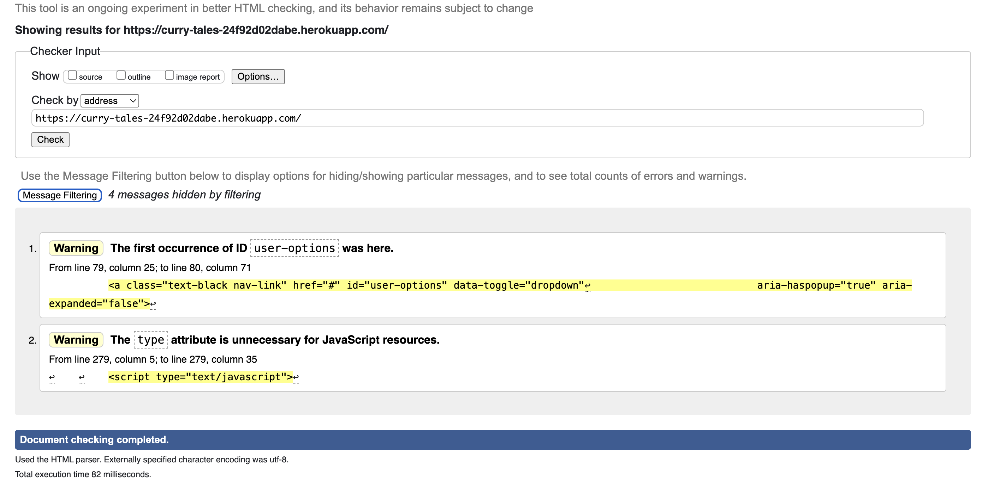 <!-- Check some image here--> 


</details><br/>

[Back to top](<#table-of-content>)

### CSS Validaton
When validating my own code the W3C CSS Validator reports no errors. The only errors shown are via url input, which have to do with the third party newsletter provider

<details><summary><b>CSS Validation Result</b></summary>


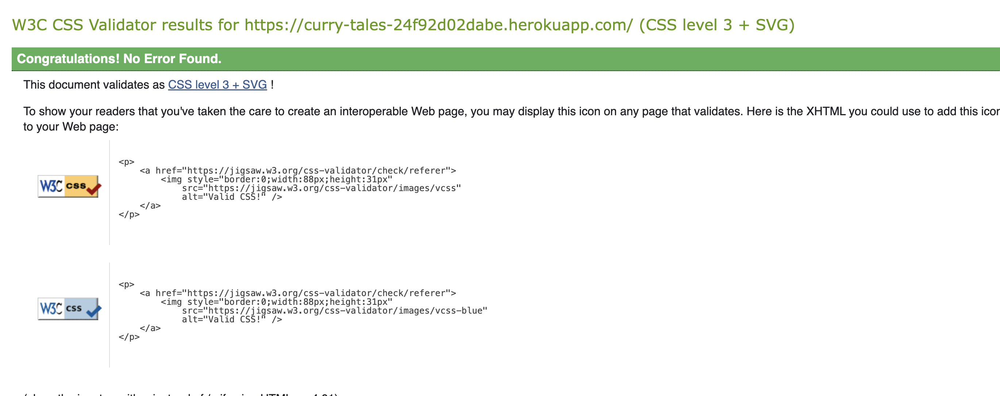 <!-- Check some image here--> 

[Back to top](<#table-of-content>)

### PEP Validation
To validate the python files, I have used the [pep8 CodeInstitute linter](https://pep8ci.herokuapp.com/) I have tested all python files in my project without getting any errors. The documentation can be found in the [folder](documentation/pylint_test/). Every picture is labled with the first word as the corresponding app and the name of the python file. 45 out of the 47 files reported no error - just the webhook.py file in the checkout app, as well as in the settings the "AUTH_PASSWORD_VALIDATORS" were longer than 79 lines. Both files have been fixed.
<!-- Check the above content--> 

[Back to top](<#table-of-content>)

### JavaScript Validation
The JSHint validator results can be seen below, only 3 files are shown. the rest of the validation can be found in this [folder](documentation/images/JS_News.png) <!-- correct folder pl. --> 

No errors were returned when passing through JSHint, the tests reported undefined variables and gave out a total of 8 warnings. None of these are problematic. 

<details><summary><b>JSHint Validation Result</b></summary>
 

JS for the newsletter:

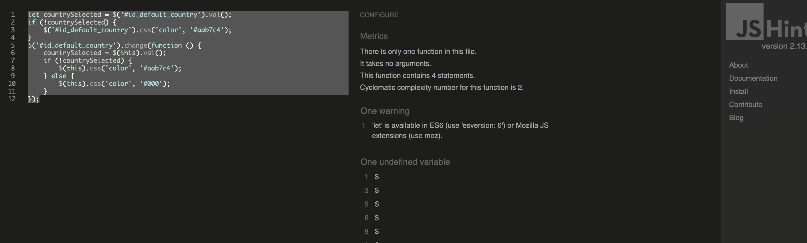 <!-- Check some image here--> 

[Back to top](<#table-of-content>)

</details><br/>


### Manual Testing

All the manual testing can be found in this [file](ManualTesting.md) <!-- add the right file pl.--> 

<br>

### Responsiveness Test  <!-- Check this section content--> 
The responsive design tests were carried out manually with [Google Chrome DevTools](https://developer.chrome.com/docs/devtools/) and [Multi Device Mockup Generator](https://techsini.com/multi-mockup/).

| Desktop    | Display <1200px       | Display >1200px    |
|------------|-----------------------|--------------------|
| Render     | pass                  | pass               |
| Images     | pass                  | pass               |
| Links      | pass                  | pass               |

| Tablet     | iPad Air              | Asus Zenbook Fold  | iPad Mini | iPad Pro |
|------------|-----------------------|--------------------|-----------|----------|
| Render     | pass                  | pass               | pass      | pass     |
| Images     | pass                  | pass               | pass      | pass     |
| Links      | pass                  | pass               | pass      | pass     |

| Phone      | Galaxy S20 Ultra      | iPhone 12Pro/14 Pro Max    | Pixel 7 / 7 Pro      |
|------------|-----------------------|----------------------------|----------------------|
| Render     | pass                  | pass                       | pass      | pass     |
| Images     | pass                  | pass                       | pass      | pass     |
| Links      | pass                  | pass                       | pass      | pass     |

[Back to top](<#table-of-content>)

### Browser Compatibility
* Google Chrome Version (version 130.0.6723.117)
* Mozilla Firefox (version 132.0.1) - website works fully, but the both the fonts and some formatting is wrong <!-- check this text--> 
* Microsoft Edge (version 130.0.2849.80)

[Back to top](<#table-of-content>)

### Lighthouse
Google Lighthouse in Chrome Developer Tools was used to test the application within the areas of *Performance*, *Accessibility*, *Best Practices* and *SEO*. 

The test results have been mostly positive, besides the performance score (between x and y), as well as accessibility. The latter one has especially on the desktop version (all pages) and the shopping bag and product detail page issues, since there are labels missing for most buttons. I decided that this is not an issue for now since the products are not meant for the visually impaired. In the future features, I do want to implement these as well so that the page is also accessable for the visually impaired, so that they are also able to shop for books as e.g. gifts. 

I have tested every page from Curry Tales with lighthouse, every picture can be found in this [folder](documentation/lighthouse_images) <!-- insert the right folder here--> 

[Back to top](<#table-of-content>)

### Peer Review
Additional testing of the application was conducted by people outside of the software development field by friends and family. No errors and no issues with design or handling of the site were found. Also my webpage has been tested by fellow Code Institute students Marcellio, Sebastian and Jan with the same result. 

[Back to top](<#table-of-content>)

# Bugs

## Fixed Bugs <!-- Check content in this section --> 


### Bugs from Boutique ADO

**30.10.24**
Minus quantity button does not work. Fix: in JS code, change targeted IDs to target classes -> change "#" to "." to target classes -> did not fix the issue:

**13.11.2024**
Finally fixed the quantity_input_form JS code with the help of Oisin from tutor support by rewriting all variables

**11.11.2024**
Validation errors:

* Mobile-top-header throws HTML errors: li item is child of menu item. Fix: Add an ul tag with corresponding classes (Tutor support helped)
* Element p not allowed as child of element strong in this context. -> custom_clearable_file_input has that set up. Solution: removed "strong"
* custom_clearable_file_input: "Error: Bad value auto !important for attribute width on element img: Expected a digit but saw a instead" -> added a div -> did not fix the error

[Back to top](<#table-of-content>)

## Known Bugs

All known bugs are supposed to be fixed before "Future Features" are going to be implemented.

* Dynamic Pricing Fix
Previously, product prices did not update based on selected quantities or weights. This issue has now been resolved—prices dynamically reflect user selections in real time.


* Terminology Update
The label "Size" has been replaced with "Weight" across the website for improved clarity and relevance to the products.


* New Feature: FAQ Section
A Frequently Asked Questions (FAQ) section has been added to assist users by addressing common queries and improving overall usability.

 ### Known Limitations / Pending Tasks

* Incomplete Styling for FAQ Section
The newly added FAQ section is functional but lacks proper styling due to time constraints. UI/UX improvements will be considered in future updates.


* Database Schema Not Generated
The project currently lacks a defined or documented database schema. This remains a pending task for subsequent development phases.

### Developer Note

Throughout this project, I have implemented substantial changes and addressed most of the key points highlighted in the assessment criteria. Despite time constraints due to full-time work and personal responsibilities, I made every effort to meet the outlined requirements. While a few elements remain incomplete, the current version demonstrates meaningful progress and provides a solid foundation for continued development. 


[Back to top](<#table-of-content>)

# Deployment

## Deployment To Heroku

The project was deployed to [Heroku](https://www.heroku.com). Given that this is the fifth project to deploy, I will not go over the steps on creating a project in detail, since the steps have been the same as for all django projects. 

<details><summary><b>Deployment</b></summary>

To create a project, these are the steps:

1. Create a workspace with the [Code Institute Full Template](https://github.com/Code-Institute-Org/ci-full-template)

<details><summary><b>Heroku Deployment - Step 1</b></summary>

 <!-- Check some image here--> 

<!-- Check some image here--> 

 <!-- Check some image here--> 
</details><br />

2. Install Django via console commands

* ```pip3 install Django~=4.2.8```

3. Add the packages to the "requirements.txt" file 

* ```pip3 freeze --local > requirements.txt```

4. Create the project

* ```django-admin startproject YOUR_PROJECT_NAME .```

5. Create the first app

* ```python3 manage.py startapp APP_NAME```

6. Add the app to the "INSTALLED_APPS" in the settings.py file 

<details><summary><b>Heroku Deployment - Step 6</b></summary>


</details><br />

7. Run the server and retireve your local url

8. Add the local url to the "ALLOWED_HOSTS" area in the settings.py file 

<details><summary><b>Heroku Deployment - Step 8</b></summary>


</details><br />

9. Run the initial migrations

* ```python3 manage.py migrate```

<br>
<br>
Now, the project can be deployed to Heroku:
<br>
<br>

1. Create a Database from [CI](https://dbs.ci-dbs.net/)

<details><summary><b>Heroku Deployment - Step 1</b></summary>


</details><br />

2. Add your database information (see step 6, excluding the COLLECTSTATIC) to your env.py file and add the following code in the settings.py file:

<details><summary><b>Heroku Deployment - Step 2</b></summary>


</details><br />

3. Prepare your project for deployment

* Install *gunicorn*
* ```pip3 install gunicorn~=20.1```
* Install *psycopg2*
* Install *dj_database_url*
* ```pip3 install dj_database_url==0.5.0 psycopg2```
* Add the packages to the "requirements.txt" file 
* Migrate all changes
* *If* the project already has more apps, models and fixtures, also load the fixtures via *python3 manage.py loaddata "fixture name"*

<details><summary><b>Heroku Deployment - Step 3</b></summary>

 <!-- Check some image here--> 

 <!-- Check some image here--> 
</details><br />

* Create a "Procfile" and add "web: gunicorn 'project name':application" in it
* Change *Debug* in the settings.py file to *False*
* Add "'.herokuapp.com'" to the "ALLOWED_HOSTS" area in the settings.py file
* Commit the changes to Github

4. Create a new heroku app

<details><summary><b>Heroku Deployment - Step 4</b></summary>

 <!-- Check some image here--> 

 <!-- Check some image here--> 
</details><br />

5. Connect your Github repository to your new Heroku app

<details><summary><b>Heroku Deployment - Step 5</b></summary>

 <!-- Check some image here--> 
</details><br />

6. Add your secret key, *DISABLE_COLLECTSTATIC = 1* and your newly created DATABASE_URL to the Heroku Config Vars

<details><summary><b>Heroku Deployment - Step 6</b></summary>

 <!-- Check some image here--> 
</details><br />

7. Make your first manual deploy

<details><summary><b>Heroku Deployment - Step 7</b></summary>

 <!-- Check some image here--> 
</details><br />

Now, the basics of your project have been deployed to Heroku. In my case, I continued with my project until I had stripe, AWS, all fixtures and all working models ready. 

8. To set up Stripe, you will have to create a free account [here](https://dashboard.stripe.com/register). After you have created your account, retrieve your Publishable key and Secret key and add them to your env.py file, as well as to your heroku config vars. Additionally, you will have to set up all the stripe code for your project, but this was done with the [Stripe Documentation](https://docs.stripe.com/). It is important to include the following code in the checkout views.py file:

<details><summary><b>Heroku Deployment - Step 8</b></summary>

 <!-- Check some image here--> 
</details><br />

9. Create a stripe webhook for your plattform by creating a new webhook in the stripe section under *Developers* - *Event Destination* - *Add Destination* and adding your *deployed url*/checkout/wh/ in the form. After creating the webhook, you will recieve a stripe_wh_secret key.

10. The next step to complete the deployment is to create an AWS account and an S3 bucket. To create an account, you have to visit the [AWS website](https://signin.aws.amazon.com/signup?request_type=register) and follow the instructions to create the free tier account.

The best summary on how to do create the bucket and user group was provided by the Code Institute tutor Oisin with the following tutorials:

* [Create an AWS S3 Bucket](https://docs.google.com/document/d/1bqvCFiCW_JV9sllNZrN5uUJpIiusHICTk4TIk3oUWHY/edit?tab=t.0#heading=h.jypp4mbtvx4q)
* [Create an AWS Group and User](https://docs.google.com/document/d/1z6L8KKiTi3QU5rMbHXhA3QR9jQIG7wLqnScUDpe238E/edit?tab=t.0#heading=h.1ixuny26uvc)

* After finishing the steps from the documentation above, you will recieve an AWS acces key and an AWS secret key

11. Add all keys into your env.py file and the Heroku config vars:

<details><summary><b>Heroku Step 11</b></summary>

 <!-- Check some image here--> 

 <!-- Check some image here--> 
</details><br />

12. Update your settings.py file like in the picture below:

<details><summary><b>Heroku Step 12</b></summary>

 <!-- Check some image here--> 
</details><br />

13. Upload your media files to your S3 bucket by entering them in a folder called *media*

14. Make sure all of your migrations are done, your requirements.txt file is up to date and do your final manual deploy. Now your webpage is deployed and works as intended!

## How To Fork The Repository On GitHub

It is possible to do a independent copy of a GitHub Repository by forking the GitHub account. The copy can then be viewed and it is also possible to do changes in the copy without affecting the original repository. To fork the repository, take these steps:

1. After logging in to GitHub, locate the repository. On the top right side of the page there is a 'Fork' button. Click on the button to create a copy of the original repository

<details><summary><b>Github Fork</b></summary>

<!-- Check some image here--> 

* The reason why it is greyed out in the picture:


</details><br />

## Cloning And Setting Up This Project

To clone and set up this project you need to follow the next steps:

1. When you are in the repository, find the code tab and click it
2. To the left of the green GitPod button, press the 'code' menu. There you will find a link to the repository. Click on the clipboard icon to copy the URL

<details><summary><b>Github Create Local Clone</b></summary>


</details><br />

3. Use an IDE and open Git Bash. Change directory to the location where you want the cloned directory to be made
4. Type 'git clone', and then paste the URL that you copied from GitHub. Press enter and a local clone will be created
5. To be able to get the project to work you need to install the requirements. This can be done by using the command below:

* ```pip3 install -r requirements.txt``` - This command downloads and install all required dependencies that is stated in the requirements file

6. Make sure that all sensitive information are placed in an env.py file which is excluded from commits via the gitignore file

* ```python3 manage.py migrate``` - This will do the necessary migrations.
* ```python3 manage.py runserver``` - If everything i setup correctly the project is now live locally.

[Back to top](<#table-of-content>)

</details><br />

# Credits

## Content

* My project **Curry-Tales** has started almost as a copy of the example project *Boutique ADO* and has been edited in most areas ever since, but especially the **Category**, **Checkout** and **Shopping bag** models, as well as the JS code has been almost unaltered.

* I used some help from various more YouTube tutorials and w3schools tutorials.

*For the deployment I used the newly supplied google documents from Oisin (CI Tutor) for creating the AWS accound and setting up the S3 bucket

* All pictrures on the webpage were gathered from multiple webpages. A list of all the references are found [here](readme/text-files)

* The project still includes the [helper_txt](helper_txt) folder, which I decided to keep in the project since it shows how I did my code. In a real project, I would have added it to the gitignore file

## Technical

* Many different posts on [Stackoverflow](https://stackoverflow.com/) have helped me understand Django and its functionality better, as well as it helped me fix bugs while coding

* The [Bootstrap](https://getbootstrap.com/) documentation helped me a lot with the styling of my page

* The AI tool [perplexity](https://www.perplexity.ai/) was used a lot for debugging and helping to understand my mistakes. No code was written by AI, the tool was just used in case of bugs and missing understanding on how a feature works

* The *Boutique ADO* code along project from Code Institute has been a valuable source for both starting the project as well as for setting up new apps, models, urls and views even if it created quite some issues along the way since it is pretty outdated and created validation problems


## Media

# Acknowledgements

* I have to thank my dear partner for being so patient since there is not a lot of free time and yet she fully supports me on a daily basis

* I am also thankful for my co-student Sebastian and Jan, who I worked closely together, and who helped me with questions, gave their input and in times of question.

* A big thank you goes out to the Tutors who have helped me along my fourth protfolio project

* I would like to thank my mentor for giving me the right pointers in the first meeting and for helping me finish the project and giving me very valuable advice.


[Back to top](<#table-of-content>)


